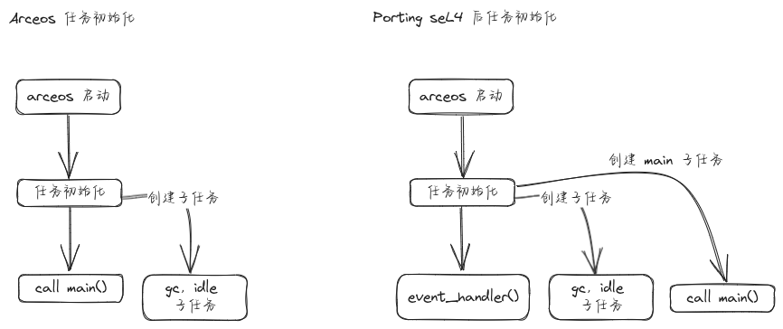

## 1. 简介

最近一直在尝试将 [arceos](https://github.com/arceos-org/arceos) unikernel 移植到 seL4 系统上，本质是将 arceos 作为 seL4 的一个应用，在其上运行。

需要移植的内容主要包括以下内容

- 驱动和 axplat
- 中断和异常处理
- 任务和调度
- 内存管理及 tls

移植到 seL4 上的主要目的是利用 seL4 的安全性，通过 capability 机制分配所有资源。

在 sel4 上运行的时候，默认启用以下 arceos 特性

```
onsel4 = ["axhal/onsel4", "axruntime/onsel4", "axtask/onsel4", "multitask", "alloc", "page-alloc-4g", "tls"]
```

## 2. 内存管理及 tls

### 2.1 内存管理

在 arceos 中，初始化的时候会创建 kernel 内存空间，创建页表进行映射，后续就无需不停的创建页表并映射了。

seL4 中的内存同样通过 **能力** 管理，具体介绍可看 [seL4 vspace](https://rel4team.github.io/zh/docs/beginners/vspace/)

移植到 seL4 上时，同样是在初始化时映射所有内存，具体内容如下

1. axruntime 中禁用 axmm::init_memory_management，其中设计很多页表等操作，实在无法剥离。因此我在 axhal 中单独写了一个内存初始化函数，放弃了 axmm 的功能。不过也可以修改 axmm 的后端，通过 axmm 操作 seL4 内存管理功能。

2. rel4-linux-kit 在创建进程时，给进程在固定位置 0x2000_0000 分配一块 2M 的大页。arceos 在启动时直接使用该段内存作为堆，进行初始化。这段内存初始化后仍然可以使用，作为堆空间的一部分。

3. rel4-linux-kit 启动时给进程分配一块最大的 untyped cap，arceos 启动后使用该段内存进行内存初始化等操作。目前基本上就是将 untyped cap 全部分配为 large_frame 并映射。为了保持地址的连续性，也就是大页和大页之前紧挨着，**这块 untyped cap 上只放大页**。其他所有的能力放置在另外一个较小的 untyped 区域上。也就是说，root-task 会给进程分配一块很大和一块较小的 untyped cap

4. 外设地址由 root-task 实现映射到指定虚拟地址，arceos 直接使用映射后的虚拟地址，不用使用物理地址了

因此，arceos 中的内存可以分为以下四个部分

1. elf 文件中定义段，root-task 会将其映射并加载，并创建栈和 IPC Buffer ，是基本固定的部分，完全由 root-task 创建
2. 一个初始化时使用的堆空间，同样由 root-task 分配并映射到指定虚拟地址，供初始化时使用
3. 一个巨大的 untyped cap，直接给到 arceos，由自己维护。初始化将该段内存连续化映射后，交给 axalloc
4. 一个较小的 untyped cap，用来放 large page 之外的能力，比如上述映射过程中需要的页表，tcb 之类

由于目前只考虑 unikernel 的情况，所有 task 共享一个 vspace，所以将所有 untyped 能力都分配成 kernel 使用的内存区域。后续如果考虑 starry 移植，可能还需要再加一个 untyped 区域，或者把这块巨大的 untyped 区域进行分配，只留一部分用于 kernel space。同时要考虑类似缺页处理之类的异常处理。

### 2.2 tls

seL4 本身就支持 tls，因此无需太多改动，只需要在创建 seL4 任务时，设置 tls 任务即可。arceos 运行在 seL4 上是，tls 是必须的，因为要存储 ipcbuffer

## 3. 任务管理和调度

### 3.1 arceos 和 seL4 任务绑定

将 arceos 任务和 seL4 任务进行绑定，可以认为每个 arceos 任务就是一个 seL4 任务

```
/// seL4 task 定义，主要是包括任务关键的能力
pub struct Sel4Task {
    pub tcb: cap::Tcb,
    pub cnode: cap::CNode,
    pub ep: cap::Endpoint,
    pub entry: usize,
    pub stack: usize,
    pub capset: ObjectAllocator,
    pub untyped: cap::Untyped,
    pub ipc_buffer: cap::Granule,
    pub ipc_buffer_addr: usize,
    pub tid: usize,
}
```

```
// 在 arceos TaskInner 中加上 Sel4Task
pub struct TaskInner {
    ...
    #[cfg(feature = "onsel4")]
    sel4task: Option<Arc<Sel4Task>>,
}
```

### 3.2 任务创建和调度

由于 seL4 中的能力需要通过 cspace 去查找，只有 arceos 的初始化主任务存储了所有子任务的 tcb 能力，可以操作子任务。因此任务的创建、调度、回收等操作都应该由主任务操作，其他任务通过发送 IPC 请求给主任务，由它代为操作。

主任务在初始化完成后，会调用 sel4_handler，变成一个 event handler，循环等待 IPC、中断、异常事件。关于任务的请求也在这个循环中处理。

```
  match msg_label {
      ServiceEvent::SwitchTask => {
          let task_ptr = read_types!(ib, usize);
          reply_with!(ib, 0);
          axtask::switch_sel4_task(task_ptr);
      }
      ServiceEvent::CreateTask => {
          let (tid, entry, stack) = read_types!(ib, usize, usize, usize);
          let task_ptr = create_sel4_task(tid, entry, stack);
          reply_with!(ib, task_ptr);
      }
      ServiceEvent::ExitTask => {
          let task_ptr = read_types!(ib, usize);
          exit_sel4_task(task_ptr);
          reply_with!(ib, 0);
      }
  }
```

任务创建方面，新增了一个函数 new_with_ipc ，和 arceos 创建 task 不同，不会创建上下文，而是创建 Sel4Task. 其他任务创建过程没有区别，创建后也会加入到调度队列中。

任务调度方面，arceos 只是一个用户态任务，无法决定 seL4 调度顺序。arceos 只能将上一个任务 suspend, resume 下一个任务，确保在 arceos 中始终只有一个子任务处于可运行状态，这样 seL4 自然会调度到这个任务。

arceos 有默认的垃圾回收任务，会回收已经退出的子任务，在退出时，会调用 ExitTask 请求，由主任务将目标子任务的 seL4 capability 都回收，确保可重复分配。

### 3.3 任务初始化

Arceos 中，启动时的任务流就是 main 任务，同时还会启动 idle 和 垃圾回收任务。

移植到 seL4 上后，需要增加一个循环任务流，作为 event handler. 因此启动后的任务流在执行完初始化后变为 event handler，同时启动一个 main 任务执行 main() 函数，区别如下图。



## 4. 中断和异常处理

### 4.1 中断注册

seL4 的中断注册也是通过 capability 管理的，注册中断的权限只有 root-task 有，目前依赖 rel4-linux-kit 框架，arceos 是一个普通任务，没有中断注册的权限。

arceos 需要发送中断注册请求，由 root-task 注册，并且向 arceos 返回注册后的 irq_handler 能力

```
/// Registers a seL4 IRQ and sets up the necessary capabilities and notifications.
pub fn register_sel4_irq(&mut self, idx: usize) -> sel4::Result<()> {
    // create a notification for the IRQ
    let slot = alloc_slot();
    LeafSlot::from_cap(self.global_notify).mint_to(slot, sel4::CapRights::all(), idx as _)?;
    let notify = slot.cap();
    self.notifications.insert(idx, notify);

    // create an IRQ handler
    let irq_handler = alloc_slot().cap();
    register_irq(idx as _, irq_handler.into());

    // set up the IRQ handler
    irq_handler.irq_handler_set_notification(notify)?;
    irq_handler.irq_handler_ack()?;
    self.irq_handlers.insert(idx, irq_handler);

    Ok(())
}
```
> 目前中断注册只考虑单个 arceos 的情况，比如时钟中断是独占的。后续将 root-task 中断管理改成类似 hypervisor 的管理方式，使得多个系统可以共享中断

### 4.2 中断处理

seL4 中，可以将中断对应的 notification 绑定到 tcb 上，当该任务在监听 endpoint 时，同样会监听该 notification。

因此主任务在 event_handler 中同样在监听中断 notification。能够获取中断后，根据 notification 的 badge，可以获取中断号，并进行相应的中断处理。

```
pub(crate) fn event_handler() -> ! {
    ...
    let (msg, _badge) = DEFAULT_SERVE_EP.recv(());
    #[cfg(feature = "irq")]
    if msg.label() == 0 {
        // handle interrupt
        handle_irq(_badge as _);
        continue;
    }
```

### 4.3 异常处理

TODO

## 5. 驱动和 axplat 

### 5.1 arceos 驱动移植

arceos 中本身的驱动不需要怎么修改，只需要 root-task 将 arceos 使用的外设地址映射到指定虚拟地址，同时将这些虚拟地址设置到 axconfig.toml 中。

驱动使用的 DMA 区域则同样是通过 arceos 中的 allocator 分配，只需要做好虚实地址转换即可。

### 5.2 axplat

arceos 中将硬件平台相关的实现都集中到 axplat 中，这样增加硬件平台不用修改 arceos 主仓库。

我们可以将 seL4 系统抽象成一个硬件平台，实现 axplat-aarch64-sel4 crate，实现 bsp 相关功能。

需要实现的部分，axplat 已经定义了一个框架，主要是包括

- 内存管理
- 中断管理
- 时钟
- console
- power

内存和中断实现参考上述段落，其他实现参考其他平台实现即可。

## 6. arceos 主仓库改动

即使大部分实现在 axplat 中，arceos 主仓库的改动仍然不可避免，我增加了一个 onsel4 feature, 用于区分。

改动集中在 axhal axruntime axtask 三个仓库，具体改动请查阅 [代码仓库](https://github.com/reL4team2/arceos/tree/sel4-porting)。

## 7. 讨论

1. 目前调度效率很低，涉及到多次 syscall 操作，希望能找到某种方法提高调度效率。