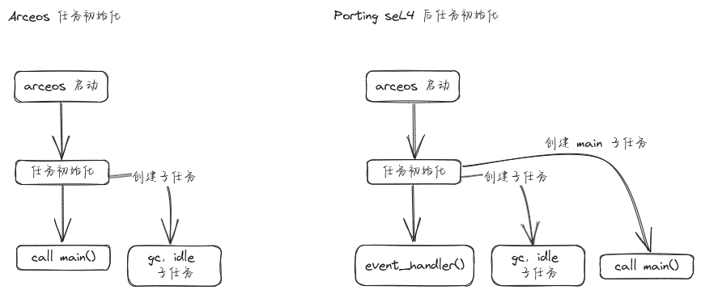

## 1. 简介

由于 ArceOS 本身就有完整的任务和调度设计，如何将其和 seL4 的任务及调度系统融合，是移植过程中必须解决的问题。主要设计要点如下

- 在启动时，每个核心上会额外启动一个 seL4 任务，作为管理任务，负责创建，调度，迁移子任务。该核心上其他任务都是它的子任务。

- 每个 ArceOS 任务就是一个独立的 seL4 任务，只不过共享同一个 vspace，类似线程。

- 调度器使用 ArceOS 调度器，但是调度操作通过 seL4 的 TCB 操作实现。基本就是 suspend 上一个任务，resume 下一个任务。

- 创建，调度，迁移任务都是由子任务发送 IPC 请求给管理任务，由管理任务执行具体操作。

- 子任务的 cspace 作为一个 cnode 包含在管理任务中，因此管理任务可以访问子任务的能力。



## 2. 背景知识

在不打开 MCS 时，seL4 调度基本是一个带优先级的 RR 调度器，同时可以手动 suspend 和 resume 任务，同时可以迁移任务到不同的 CPU 核心。因此基本可以将 seL4 的调度器当作透明的存在，可以使用 arceos 调度机制。

进行调度时，需要操作该任务的 TCB 能力，因此必须要有一个管理任务，该任务拥有所有子任务的 TCB 能力，可以进行调度操作。

## 3. 实现

### 3.1 任务组成元素

首先看一下每个 seL4 子任务的结构体设计

```
/// Basic unit representing a task in seL4.
pub struct NormalTask {
    // 该任务所有能力的集合，放在一起是为了方便管理
    pub capset: CapSet,
    // 分配给该任务的 untyped 能力，所有能力都是从其中分配出来的 (共享的内存能力除外)
    // 基本上每个任务需要能力是固定的，所以 untyped 能力大小是固定的
    pub untyped: cap::Untyped,
    // 分配给该任务的 ipc buffer 区域
    pub ipc_buffer_addr: VirtAddr,
    // 任务的唯一标识符
    pub tid: usize,
    // 任务的 CPU 亲和性，迁移时会用到
    pub affinity: usize,
    // 任务在管理任务 cspace 中的 cnode 索引，管理任务通过该索引找到该任务的能力
    pub cnode_index: usize,
    // 任务是否刚刚被迁移了，需要在下一次调度时设置亲和性
    pub migrate: bool,
    // 任务创建时所在的 CPU 核心，主要是为了回收 untyped 能力时使用，必须把 untyped 回收到创建它的核心上
    pub created_cpu: usize,
}
```

### 3.2 任务服务

所有任务操作都由管理任务执行，其提供以下任务服务

```
/// 定义服务事件枚举
#[derive(Debug, IntoPrimitive, TryFromPrimitive)]
#[repr(u64)]
pub enum ServiceEvent {
    /// 创建任务
    CreateTask = 0x1000,
    /// 切换任务
    SwitchTask,
    /// 退出任务
    ExitTask,
    /// 退出系统
    ExitSystem,
    /// 迁移任务
    MigrateTask,
}
```

### 3.3 任务创建

任务创建是一个固定的过程，对于子任务来说，创建时已经申请了其所有需要的能力，运行时不需要再申请其他能力。

任务创建主要流程如代码所示

```
    // 分配一块 untyped 区域，固定大小为 256KB
    let untyped = alloc_untyped(cpu_id);
    // 分配一个空闲的 cnode index 给该任务
    let cnode_index = TASK_CSPACE_ALLOCATOR
        .lock()
        .alloc()
        .expect("no more cnode index");

    // 创建一个 capset，其中会创建子任务的 root_cnode 并且 move 到父任务的 cspace 中
    let mut capset = CapSet::new(cnode_index, CNODE_RADIX_BITS, untyped, 0x100).unwrap();

    // 创建 TCB 能力，通过 capset 创建，受 capset 管理
    let tcb = capset.alloc_tcb(Some(1))?;

    // 创建一个 Endpoint，目前没有用到
    capset
        .alloc_endpoint(Some(DEFAULT_SERVE_EP.bits() as usize))
        .unwrap();

    // 将父任务的 Endpoint 能力 mint 到子任务 cspace 中，子任务通过该能力发送 IPC 请求给父任务
    capset
        .root_cnode()
        .absolute_cptr_from_bits_with_depth(DEFAULT_PARENT_EP.bits(), 64)
        .mint(
            &LeafSlot::from(DEFAULT_SERVE_EP).abs_cptr(),
            CapRights::all(),
            tid as _,
        )
        .unwrap();

    // 分配 IPC buffer 区域，并进行 map
    let (virt, ipc_cap) = alloc_ipc_buffer_by_capset(&mut capset)?;

    // 这段是为了 SMP 任务迁移准备的，将子任务的 cnode 能力 copy 到其他核心的管理任务 cspace 中
    // 这样迁移到其他核心时，该核心上的管理任务就能访问该任务的能力了
    for i in 0..axconfig::plat::CPU_NUM {
        if i == cpu_id {
            continue;
        }

        let _ = LeafSlot::new(0x90 + i)
            .cap()
            .absolute_cptr_from_bits_with_depth(cnode_index as _, 52)
            .delete();

        let _ = LeafSlot::new(0x90 + i)
            .cap()
            .absolute_cptr_from_bits_with_depth(cnode_index as _, 52)
            .copy(&capset.root_cnode_path(), CapRights::all());
    }

    // 配置 TCB，使用管理任务的 VSPACE，这样就共享了地址空间
    tcb.tcb_configure(
        DEFAULT_PARENT_EP.cptr(),
        capset.root_cnode(),
        CNodeCapData::skip_high_bits(CNODE_RADIX_BITS),
        init_thread::slot::VSPACE.cap(),
        virt.as_usize() as _,
        ipc_cap,
    )
    .unwrap();

    // 设置 tls 区域
    tcb.tcb_set_tls_base(_tls as _)?;

    // 设置任务优先级，子任务优先级需要低于管理任务
    tcb.tcb_set_sched_params(sel4::init_thread::slot::TCB.cap(), 0, priority as _)?;

    // 设置任务初始上下文，其中 x28 被用于存放 per-cpu area 基址，因为在用户态实在找不到寄存器放了
    let mut regs = tcb.tcb_read_all_registers(true)?;
    *regs.pc_mut() = entry as _;
    *regs.sp_mut() = sp as _;
    *regs.gpr_mut(8) = virt.as_usize() as _;
    *regs.gpr_mut(0) = cpu_id as _;
    *regs.gpr_mut(28) = percpu::percpu_area_base(cpu_id) as _;

    tcb.tcb_write_all_registers(false, &mut regs)?;

    // 设置任务亲和性
    tcb.tcb_set_affinity(cpu_id as _)?;
```

### 3.4 任务调度

通常在 kernel 中，任务调度通过上下文切换实现。但是目前设计中，每个 ArceOS 任务都是一个 seL4 任务，所以只能通过 seL4 kernel 切换任务。

普通任务由于无法访问下一个任务的 tcb，所以需要请求管理任务进行任务切换。切换的实现如下，基本就是 suspend 上一个，resume 下一个任务。

```
pub fn switch_sel4_task(prev_tid: usize, next_tid: usize) {
    if let Some(t) = TASK_MAP.lock().get(&prev_tid) {
        // t.lock().suspend().unwrap();
        // 这里是比较重要的设计，将 pc 往下移到下一个指令，类似 kernel 中处理 syscall 的操作
        // 如果不这么做，子任务始终会不停的发送 IPC 请求，就像一直发送 ecall 一样
        t.lock().add_pc_offset(4).unwrap();
    }

    if let Some(t) = TASK_MAP.lock().get(&next_tid) {
        t.lock().start().unwrap();
    }
}
```

### 3.5 任务迁移

多核系统中，涉及到任务在不同核心上迁移，借助 seL4 设置亲和性 syscall 实现。

任务迁移分为两步，首先当 ArceOS 执行核心迁移操作时，在 NormalTask 中增加一个 flag，告知该任务需要迁移。

等到下一次启动该任务时，会对该任务执行真正的迁移操作，如下实现

```
pub fn migrate(&mut self, target: usize) -> sel4::Result<()> {
    if self.affinity == target {
        return Ok(());
    }

    // 设置亲和性，迁移标志位
    self.affinity = target;
    self.migrate = true;

    Ok(())
}

pub fn start(&mut self) -> sel4::Result<()> {
    if self.migrate {
        // 将父任务的 Endpoint 改成当前核心的管理任务
        // 先删除 DEFAULT_PARENT_EP
        sel4::init_thread::slot::CNODE
            .cap()
            .absolute_cptr_from_bits_with_depth(
                (self.cnode_index << 12) as u64 + DEFAULT_PARENT_EP.bits(),
                64,
            )
            .delete()?;

        // 将当前核心管理任务 DEFAULT_PARENT_EP mint 到当前子任务
        sel4::init_thread::slot::CNODE
            .cap()
            .absolute_cptr_from_bits_with_depth(
                (self.cnode_index << 12) as u64 + DEFAULT_PARENT_EP.bits(),
                64,
            )
            .mint(
                &LeafSlot::from(DEFAULT_SERVE_EP).abs_cptr(),
                CapRights::all(),
                self.tid as _,
            )?;

        let tcb = LeafSlot::new((self.cnode_index << CNODE_RADIX_BITS) + 1).cap();
        let mut regs = tcb.tcb_read_all_registers(true).unwrap();

        // 修改 percpu 到当前核心
        *regs.gpr_mut(28) = percpu::percpu_area_base(self.affinity) as _;

        // 修改任务 cpu 亲和性
        tcb.tcb_write_all_registers(false, &mut regs).unwrap();
        tcb.tcb_set_affinity(self.affinity as _).unwrap();

        self.migrate = false;
    }

```

### 3.6 任务退出

退出时需要仔细的处理资源回收，如下

```
pub fn exit(&self) {
    // 回收所有能力到 untyped 能力
    self.capset.drop().unwrap();
    // 回收 ipc buffer
    dealloc_ipc_buffer(self.ipc_buffer_addr);
    // 删除子任务 root cnode
    for i in 0..axconfig::plat::CPU_NUM {
        let _ = LeafSlot::new(0x90 + i)
            .cap()
            .absolute_cptr_from_bits_with_depth(self.cnode_index as _, 52)
            .revoke();

        let _ = LeafSlot::new(0x90 + i)
            .cap()
            .absolute_cptr_from_bits_with_depth(self.cnode_index as _, 52)
            .delete();
    }
    // 回收空白的 untyped 能力
    recycle_untyped(self.untyped, self.created_cpu);
    // 回收分配的 cnode_index
    TASK_CSPACE_ALLOCATOR.lock().recycle(self.cnode_index);
}
```

### 3.7 ArceOS 适配

ArceOS 中的适配，主要是在创建，切换等过程中需要 seL4 任务的支持。比如创建任务的时候，需要同时创建一个 seL4 任务对象，供切换时使用。

如上所说，所有操作都是需要发送 IPC 请求给管理任务，为了简化 IPC，使用 task_id 代表 NormalTask 实例。同时管理任务中会使用 map 建立 task_id 和 NormalTask 的映射关系，这样管理任务就可以通过 task_id 找到对应的 NormalTask 实例进行操作。

```
pub fn start_sel4_task(tid: usize) {
    // 从 map 中根据 tid 找到对应实例
    if let Some(t) = TASK_MAP.lock().get(&tid) {
        t.lock().start().unwrap();
    }
}
```

## 4. 讨论

1. 当前每个 arceos 任务对应一个 seL4 任务，这样设计的好处是简单直接，缺点是每个任务都有独立的内核栈和 TCB，资源开销较大。如果需要优化，可以考虑将多个 arceos 任务映射到同一个 seL4 任务中，通过用户态线程库实现任务切换和调度，从而减少内核资源的消耗。

2. 任务调度完全依赖于 seL4 的 suspend 和 resume 操作，这样设计的好处是利用了 seL4 已经验证过的调度机制，缺点是多次 syscall 开销较大，也许有可探索的更加方案。比如事先将优先级排好，如果没有特别情况，直接让出当前任务，也许可以自动切换到下一个准备好的任务。